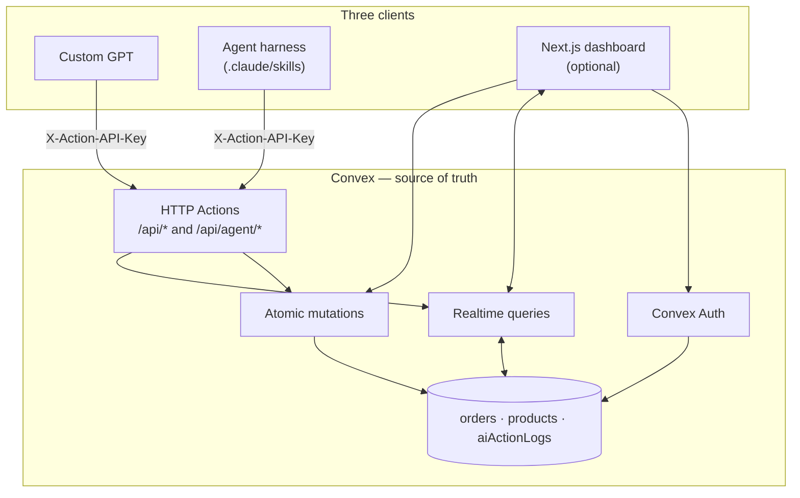
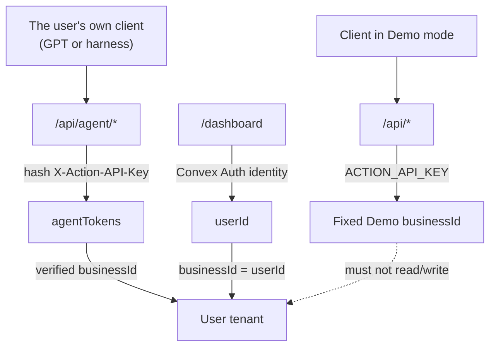
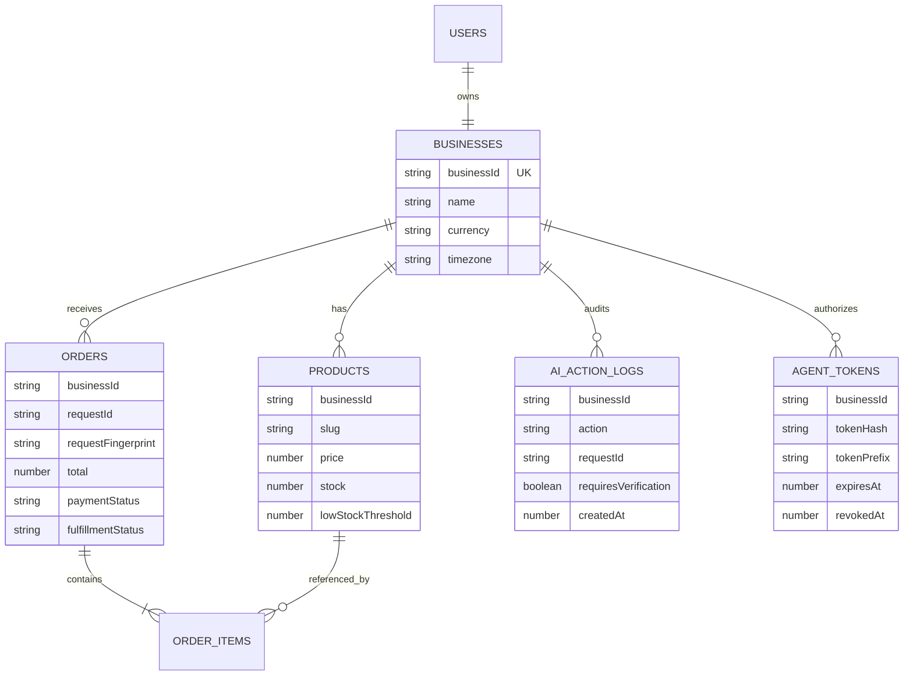
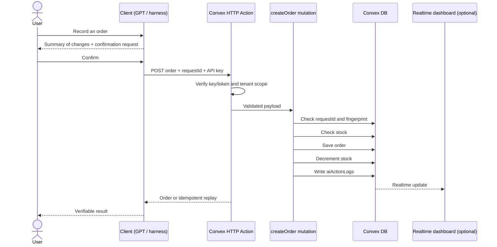

# Asisten Pribadi AI

> **Reference build — GPTs as your agent.**
> One Convex backend, one set of Actions. A Custom GPT, an agent harness (Claude Code), or the web dashboard — all three drive the same data.

[](https://nextjs.org/)
[](https://www.convex.dev/)
[](https://www.typescriptlang.org/)
[](LICENSE)
[](https://github.com/rahmanef63/codex-build-week/actions/workflows/ci.yml)

[](https://vercel.com/new/clone?repository-url=https://github.com/rahmanef63/codex-build-week&env=NEXT_PUBLIC_CONVEX_URL,CONVEX_DEPLOY_KEY&envDescription=Hubungkan%20deployment%20Convex%20Anda.&envLink=https://github.com/rahmanef63/codex-build-week%23deploy-your-own)

[Landing](https://codex-build-week.vercel.app/) ·
[Interactive demo](https://codex-build-week.vercel.app/demo) ·
[Dashboard](https://codex-build-week.vercel.app/dashboard) ·
[Docs & onboarding](https://codex-build-week.vercel.app/docs) ·
[Deployment setup](https://codex-build-week.vercel.app/setup) ·
[Presentation](https://codex-build-week.vercel.app/presentation) ·
[Custom GPT package](GPTs/alfa.md)

## Five-minute local check

Requirements: Node.js 22+, npm 10, and a Convex deployment. Copy
`.env.example` to `.env.local`, fill the required values, then run:

```bash
npm ci
npm run convex:sync
npm run dev
```

Open `http://localhost:3000`. Run `npm run check` before submitting a change.
See [Running locally](#running-locally) for environment details and
[Deploy your own](#deploy-your-own) for a clean production deployment.

## What this reference build proves

Most "GPT + API" demos stop at a single client: a Custom GPT that calls an
endpoint, and that is the end of it. This repository shows the opposite pattern
— **the backend is the product**, and any client is free to drive it.

What it proves:

- A single Convex deployment as the only source of truth.
- A single HTTP surface (`/api/agent/*`) scoped by token, not by client input.
- Three different clients writing to the same data, with identical tenant
  isolation and audit logging guarantees.
- An **optional** frontend: once a token is issued, every operation runs without a single web page.

### Three clients, one backend

| Client | How it connects | Required? |
| --- | --- | --- |
| **Custom GPT** | GPT Actions call `/api/agent/*` (your own data) or `/api/*` (Demo) with the `X-Action-API-Key` header | No |
| **Agent harness** (Claude Code or a similar harness) | The repo-local skill at [`.claude/skills/asisten-pribadi/SKILL.md`](.claude/skills/asisten-pribadi/SKILL.md) calls the same HTTP endpoints | No |
| **Web dashboard** (Next.js) | Convex Auth identity; `businessId = userId` | **Optional** (only to issue the first token) |

Every client crosses the same trust boundary. There is no privileged path: the
dashboard has no access a token lacks, and a token has no access the dashboard
lacks.

### Two zones: the product surface and the worked example

This reference build has two deliberately separated zones. Both use the same
backend, schema, and Actions — only what they present differs.

| Zone | Where | Contents |
| --- | --- | --- |
| **Product surface** | Landing (`/`) and the Real Mode dashboard (`/dashboard`) | A general-purpose, domain-neutral personal assistant. No warung, no food, no customer scenarios. The workspace is filled by your own agent, whatever it puts there. |
| **The worked example** | `/demo`, the deck at `/presentation`, and the Convex seed (`convex/seed.ts`, tenant `warung_nasi_bu_sari`) | One concrete scenario: a warung recording orders through conversation. The canonical case is Bu Rina's order — `3 Nasi Ayam + 2 Es Teh` = **Rp55.000**, stock down by five items, an audit log entry written. |

**The warung is an example, not the product — and the example stays inside its
zone.** The landing page and the dashboard never present warung, food, or
customers as the product domain. Conversely, `/demo`, `/presentation`, and the
seed are not watered down: that is where the pattern is proven to actually work.

The data vocabulary — **orders** (`create_order`), **products**
(`create_product`), stock, and activity logs — is used in both zones. Those
names map one-to-one to the published operation IDs, so renaming them would only
break the mental model of anyone wiring up their own GPT. What gets generalized
is the framing around them, not the nouns: Convex here is a workspace your agent
writes to, not a warung app.

## Two modes

| Mode | Purpose | Data | Access |
| --- | --- | --- | --- |
| **Demo** | Proves the six GPT Actions using the example scenario | Synthetic, Warung Nasi Bu Sari | Public at `/demo` |
| **Dashboard** | Your own catalog, orders, activity, and Agent configuration | Isolated per user | Authenticated at `/dashboard` |

Demo mode is the only place the warung scenario appears in the app. Dashboard
mode is domain-neutral: it holds only what you or your agent write.

The legacy `/real` route is kept as a permanent redirect to `/dashboard`.

The landing page is available in Bahasa Indonesia, English, Français, and 日本語.
The demo, dashboard, GPT Actions, currency, and time zone remain Indonesia-first
(`IDR`, `Asia/Jakarta`); this project does not yet claim full product
localization outside Indonesia.

## Principles

Generic AI can answer questions, but it does not automatically have the right
data source or proof that a change actually happened. This reference build
closes that gap with four principles:

- **Convex as the single source of truth.**
- **Atomic mutations:** the order, stock, and audit log change together.
- **Confirmation before mutation**, built into the client instructions (both the Custom GPT and the harness skill).
- **The tenant is never trusted from the request:** the server derives it from a
  verified identity or token.

## Features

- A token-scoped HTTP surface (`/api/agent/*`) for summaries, orders, the business profile, and product CRUD.
- Six stable Demo GPT Actions on `/api/*`.
- A repo-local skill in `.claude/skills/` so an agent harness can use the same backend without a frontend.
- Per-business Agent Setup with a generated schema and a show-once token.
- Token rotation: issuing a new token automatically revokes the previous one.
- `requestId` idempotency to prevent duplicate orders on retry.
- An optional realtime dashboard: today's summary, orders, products and stock, and AI Activity.
- Password sign-up and sign-in via `@convex-dev/auth`; tenant isolation through `businessId = userId`.
- A 1200×630 PNG dashboard card that carries only safe aggregate data.
- A responsive UI with a desktop sidebar and a compact mobile dock.
- Tests for domain logic, tenant isolation, HTTP Actions, the mode boundary, UI contracts, and the presentation.

## Architecture



The dashboard is just one consumer. Delete `app/` and Convex still serves the
Custom GPT and the agent harness unchanged.

### The Demo and dashboard boundary



- Demo endpoints use one fixed synthetic `businessId`.
- Agent endpoints never accept a `businessId` from the body, query string, or path.
- The dashboard derives its scope from the signed-in identity.
- Agent tokens are stored as hashes; the raw value is shown once, only to the authenticated owner.

### Data model



### Order creation flow

The flow below uses a Custom GPT as the example client. An agent harness takes
the same path; only the caller differs.



## Stack

- [Convex](https://www.convex.dev/) for the database, realtime queries, mutations, HTTP Actions, and auth — **the core of this reference build**.
- A Custom GPT with OpenAPI Actions.
- An agent-harness skill in `.claude/skills/`.
- [Next.js 16](https://nextjs.org/) App Router, React 19, and strict TypeScript — the optional dashboard.
- [`@convex-dev/auth`](https://labs.convex.dev/auth) with the Password provider.
- Tailwind CSS v4 and shadcn/base-ui components.
- Vitest and `convex-test`.
- Vercel for Next.js hosting; Convex Cloud for the backend.

## Repository structure

```text
convex/                  schema, auth, domain logic, HTTP Actions  ← product surface
  http.ts                the six Demo Actions on /api/*
  agent_routes.ts        per-business Actions on /api/agent/*
GPTs/                    Custom GPT instructions and schema
docs/                    guides by coding background
.claude/skills/
  asisten-pribadi/       SKILL.md + agent.mjs — agent harness client
app/                     optional Next.js dashboard
  (public)/              landing, Demo, interactive docs, legal pages
  (workspace)/           authenticated dashboard and the /real redirect
  api/dashboard-card-image/
components/ui/           UI primitives
public/presentation/     standalone hackathon deck
shared/                  cross-slice code
slices/
  demo-dashboard/
  real-dashboard/
  theme-presets/
tests/                   unit, integration, boundary, and contract tests
```

## Running from an agent harness

The third client needs no browser. The repo-local skill at
[`.claude/skills/asisten-pribadi/SKILL.md`](.claude/skills/asisten-pribadi/SKILL.md)
lets a coding-agent harness (Claude Code or similar) **drive the same backend
with no frontend at all**: the harness reads the skill, uses a per-business
token, then calls `/api/agent/*` directly — through `curl` or the bundled
`.claude/skills/asisten-pribadi/agent.mjs` helper.

```bash
export CONVEX_SITE_URL="https://<deployment>.convex.site"   # .site, not .cloud
export AGENT_TOKEN="..."                                    # from Agent Setup
node .claude/skills/asisten-pribadi/agent.mjs get_business_profile
```

The only step that still requires the dashboard is **issuing the first token**:
`agent.issue` requires a signed-in owner (`requireUserId`), so the token is
created once at **/dashboard → Siapkan asisten AI**. Once the token exists, every
operation runs headless.

The rules are identical to the Custom GPT path:

- The token travels in the `X-Action-API-Key` header and is never written to chat, logs, issues, or the repository.
- The server determines `businessId` from the token; the harness must not send it.
- Mutations require user confirmation first, plus an idempotent `requestId`.
- Every mutation is recorded in `aiActionLogs` and shows up immediately in the dashboard, if the dashboard is used.

## Deploy your own

This reference build follows a **clone-to-own** pattern: Vercel, the cloned
repository, the Convex deployment, and all the data live in your own accounts.

1. Create a project in the [Convex Dashboard](https://dashboard.convex.dev).
2. From the Production deployment, copy the `.convex.cloud` URL and create a deploy key with the `deployment:deploy`, `env:view`, and `env:write` permissions.
3. Click the **Deploy with Vercel** button above. Vercel clones the repository and asks for:

   ```dotenv
   NEXT_PUBLIC_CONVEX_URL=https://your-deployment.convex.cloud
   CONVEX_DEPLOY_KEY=prod:your-deploy-key
   ```

4. Deploy. `build:auto` then:

   - creates the Convex Auth signing key if it does not exist yet;
   - generates `ACTION_API_KEY` and `DEMO_RESET_KEY` without printing their values;
   - aligns `SITE_URL` and `DASHBOARD_PUBLIC_URL`;
   - deploys the Convex schema and functions;
   - seeds the Demo data only if the Demo tenant is still empty; and
   - builds the Next.js app.

5. Open `/dashboard`, sign up, then fill in your profile and catalog.

Every step is idempotent. A redeploy does not rotate the auth key, does not
double-seed, and does not delete data. The same checklist is available at
[`/setup`](https://codex-build-week.vercel.app/setup).

> Only need the backend? Deploy Convex alone (`npx convex deploy`) and skip Vercel.
> You lose the dashboard and the PNG card; the six Demo Actions and all of
> `/api/agent/*` keep working. Note: issuing a per-business token requires a
> signed-in owner, so run the dashboard once (locally is fine) to create the first token.

## Running locally

### Prerequisites

- Node.js 22+
- A Convex account
- Git

### 1. Install

```bash
git clone git@github.com:rahmanef63/codex-build-week.git
cd codex-build-week
npm install
```

### 2. Configure the local environment

Copy `.env.example` to `.env.local`, then fill in the Convex deployment binding:

```dotenv
CONVEX_DEPLOYMENT=dev:your-deployment
NEXT_PUBLIC_CONVEX_URL=https://your-deployment.convex.cloud
DASHBOARD_PUBLIC_URL=http://localhost:3000
```

Never commit API keys, Agent tokens, JWT private keys, or any other secret to Git.

### 3. Sync Convex Cloud

This project uses Convex Cloud, not a local Convex backend.

```bash
npm run convex:sync
```

### 4. Run Next.js

```bash
npm run dev
```

Open [http://localhost:3000](http://localhost:3000).

## Deployment configuration

### Next.js/Vercel environment

| Variable | Required | Notes |
| --- | --- | --- |
| `NEXT_PUBLIC_CONVEX_URL` | Yes | Client URL of the Convex deployment |
| `CONVEX_DEPLOY_KEY` | Clone deploy | Production key for deploying the backend and bootstrapping env vars |
| `CONVEX_DEPLOYMENT` | Local | Written automatically by `npm run convex:sync` |
| `SITE_URL` | Optional | Fallback metadata URL outside Vercel |

### Convex environment

On a Vercel clone, `scripts/setup-auth.mjs` populates the following variables
automatically. Setting them manually with `npx convex env set` is only a fallback.

| Variable | Required | Notes |
| --- | --- | --- |
| `ACTION_API_KEY` | Demo | API key for the six Demo Actions |
| `DEMO_RESET_KEY` | Demo | Separate key for resetting the synthetic data |
| `DASHBOARD_PUBLIC_URL` | PNG card | HTTPS origin of the Next.js app |
| `JWT_PRIVATE_KEY` | Dashboard | Convex Auth signing key |
| `JWKS` | Dashboard | Convex Auth public key set |
| `SITE_URL` | Dashboard | App origin for auth callbacks |
| `AUTH_RESEND_KEY` | Optional | Email verification / password recovery |
| `AUTH_EMAIL_FROM` | Optional | Verified Resend sender |

Example:

```bash
npx convex env set ACTION_API_KEY "generate-a-strong-random-secret"
npx convex env set DEMO_RESET_KEY "generate-a-different-random-secret"
npx convex env set DASHBOARD_PUBLIC_URL "https://your-app.vercel.app"
```

Variables marked **Dashboard** are only needed if you use the optional frontend.
For a headless deployment, `ACTION_API_KEY` is enough.

## Sample data

Everything in this section lives in the Demo tenant (`warung_nasi_bu_sari`) and
appears only in `/demo` and the `/presentation` deck. The landing page and the
dashboard never read it.

The Demo seed creates Warung Nasi Bu Sari with five products:

| Product | Price | Initial stock | Low threshold |
| --- | ---: | ---: | ---: |
| Nasi Ayam | Rp15.000 | 60 | 5 |
| Es Teh | Rp5.000 | 60 | 8 |
| Ayam Goreng | Rp12.000 | 7 | 5 |
| Nasi Putih | Rp5.000 | 20 | 8 |
| Sambal Extra | Rp3.000 | 6 | 10 |

The canonical Bu Rina scenario is `3 Nasi Ayam + 2 Es Teh`: the total must be
**Rp55.000**, order status `PENDING`, payment `UNPAID`, stock down by five items,
and AI Activity records the mutation. These numbers are asserted in the tests —
only change them together with the tests that cover them.

## API and Actions

### The six Demo Actions

Base URL: `https://utmost-snake-682.convex.site`

| Method | Path | Operation ID | Mutates |
| --- | --- | --- | --- |
| `POST` | `/api/orders` | `create_order` | Yes |
| `GET` | `/api/orders` | `list_pending_orders` | No |
| `PATCH` | `/api/orders/{id}` | `update_order` | Yes |
| `GET` | `/api/inventory/low-stock` | `get_low_stock_items` | No |
| `GET` | `/api/summary/today` | `get_daily_summary` | No |
| `GET` | `/api/dashboard-card?view=today` | `get_dashboard_card_image` | No |

Every endpoint requires `X-Action-API-Key`. `create_order` also requires a
`requestId`; an identical payload returns the same replay, while reusing an ID
for a different payload is rejected with HTTP 409.

### Per-business Actions

The `/api/agent/*` endpoints are the surface used both by a user's own Custom GPT
and by an agent harness. Agent Setup in the dashboard generates the matching
schema and a scoped token.

```text
GET/POST     /api/agent/orders
PATCH        /api/agent/orders/{id}
GET          /api/agent/inventory/low-stock
GET          /api/agent/summary/today
GET/PATCH    /api/agent/business
GET/POST     /api/agent/products
PATCH/DELETE /api/agent/products/{id}
```

To connect a Custom GPT:

1. Follow the field-by-field package in [`GPTs/alfa.md`](GPTs/alfa.md).
2. For the Demo, import [`GPTs/temanusaha-actions.yaml`](GPTs/temanusaha-actions.yaml).
3. Choose API Key auth with the custom header `X-Action-API-Key`.
4. For your own business data, use the schema and token from **Siapkan asisten**; never put the token in chat, issues, logs, or the repository.
5. Test one read and one mutation operation in GPT Builder Preview.

To connect an agent harness, see [Running from an agent harness](#running-from-an-agent-harness).

## How Codex was used

Codex with GPT-5.6 built and reviewed this project under the repository contract
in [`AGENTS.md`](AGENTS.md). [`TASKS.md`](TASKS.md) records each objective,
exclusive write scope, verification result, and external side effect. Codex
accelerated the Convex Actions, Next.js clients, presentation, and release
checks; the consequential decisions—tenant derivation, show-once token handling,
Demo/Workspace separation, and confirmation before mutations—remain explicit in
the contract and regression tests.

## Verification

```bash
npm run check
```

That command runs:

```text
Vitest → TypeScript typecheck → Next.js production build
```

Individual commands:

```bash
npm run test
npm run typecheck
npm run build
npm run convex:sync
```

Demo cloud verification:

1. Reset the seed with `DEMO_RESET_KEY`.
2. Create the Bu Rina order.
3. Confirm the total is Rp55.000, stock decreased, the order is pending, and the audit log appears.
4. Request the dashboard card for `today`, `orders`, and `activity`.
5. Confirm the image is `no-store`, sized 1200×630, and carries no customer names, free-form summaries, or secrets.

## Security model

- All HTTP input is validated at the trust boundary.
- Demo data and user data never share a tenant.
- Agent tenant scope comes from the verified token, not from the request — the same for a Custom GPT and an agent harness.
- Only the hash of an Agent token is stored.
- Issuing a new token revokes the previously active one.
- Mutations reject negative stock, insufficient stock, and empty updates.
- Orders are idempotent via `requestId` and a payload fingerprint.
- Every mutation writes to `aiActionLogs`.
- Public cards may carry only aggregate metrics and fixed product data.
- Real customer data, secrets, and tokens must never end up in screenshots, logs, fixtures, or source control.

Report vulnerabilities as described in [SECURITY.md](SECURITY.md), not through public issues.

## MVP boundaries

Not included yet: multi-tenant admin, the WhatsApp API, a payment gateway, OCR,
accounting, forecasting, message delivery, or an Agents SDK runtime. The Demo
uses synthetic data only and processes no real payments.

This build ships exactly one data model: orders, products, stock, and activity
logs. That is its reference domain, used as-is by the landing page, the
dashboard, and the Demo — its table names, fields, HTTP paths, and operation IDs
are a published API and do not change. What is still single-domain is the
**narrative example** (the warung), and that lives only in `/demo`,
`/presentation`, and the seed. In your own clone, swapping the example means
swapping the seed and the tests that go with it; the token-scoped architecture,
the atomic mutations, and the audit log stay the same.

## Contributing

Contributions are welcome through issues and pull requests. Read [CONTRIBUTING.md](CONTRIBUTING.md)
for setup, the quality gate, change conventions, and security rules.

## License

The source code is available under the [MIT License](LICENSE).

## Acknowledgements

Built for OpenAI Build Week using OpenAI Codex, Custom GPT Actions, Next.js,
Convex, and Vercel.
