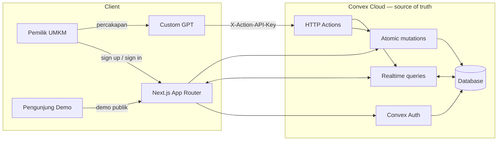
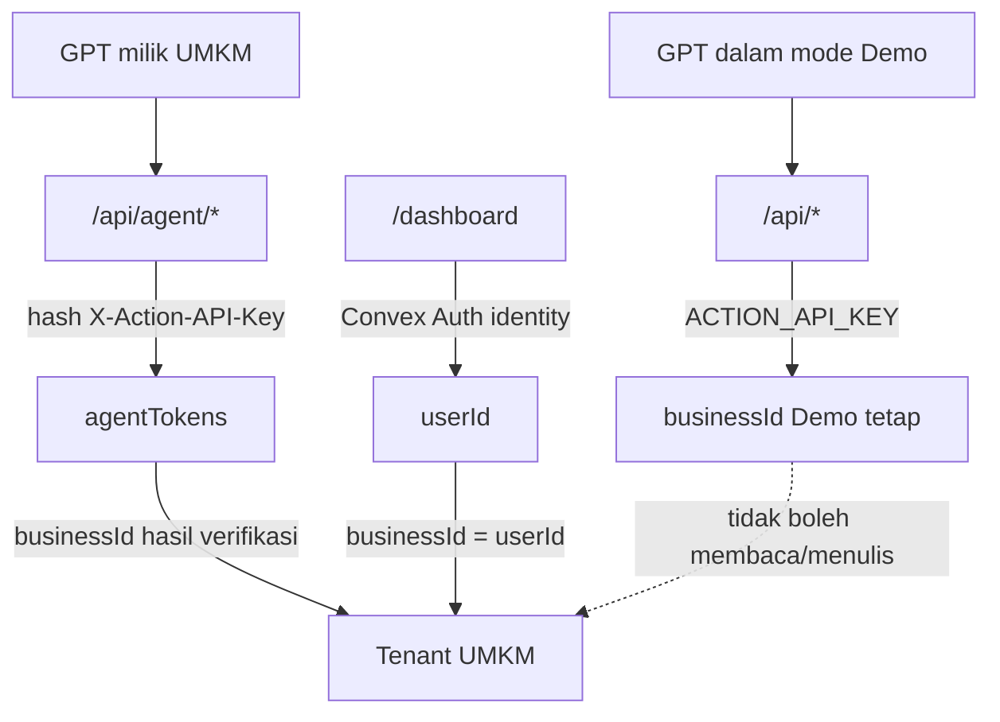
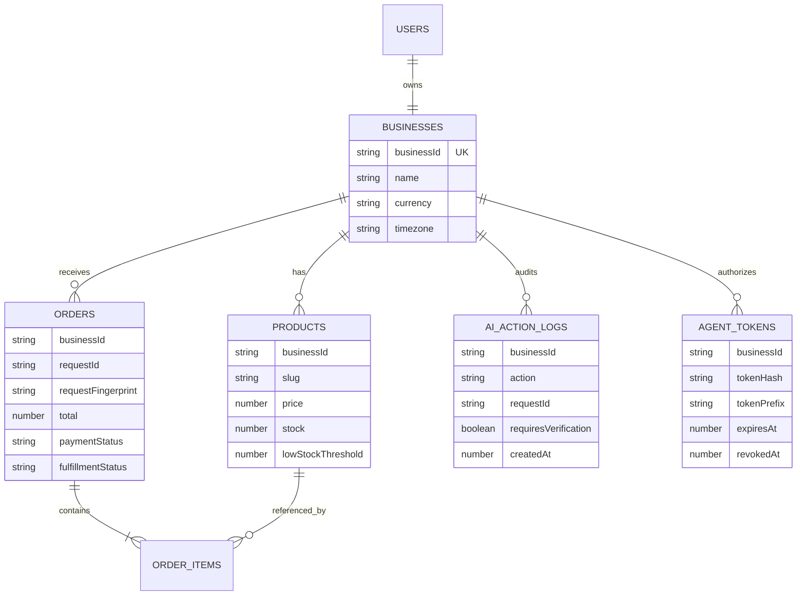
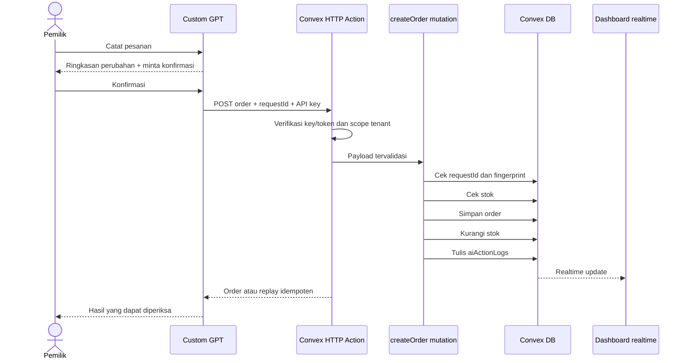

# TemanUsaha AI

> Asisten operasional berbasis GPT Actions untuk mencatat pesanan, menjaga stok, dan membuat setiap tindakan AI dapat diperiksa oleh pemilik UMKM.

[](https://nextjs.org/)
[](https://www.convex.dev/)
[](https://www.typescriptlang.org/)
[](LICENSE)

[Produk](https://codex-build-week.vercel.app/) ·
[Demo interaktif](https://codex-build-week.vercel.app/demo) ·
[Dashboard usaha](https://codex-build-week.vercel.app/dashboard) ·
[Presentasi](https://codex-build-week.vercel.app/presentation) ·
[Paket Custom GPT](GPTs/alfa.md)

TemanUsaha mengubah percakapan Bahasa Indonesia menjadi pekerjaan operasional yang terstruktur. Pesanan dibuat bersama pengurangan stok dan jejak audit dalam satu transaksi atomik. Produk ini memiliki dua mode yang sengaja dipisahkan:

| Mode | Tujuan | Data | Akses |
| --- | --- | --- | --- |
| **Demo** | Membuktikan enam operasi GPT Actions menggunakan skenario Bu Rina | Sintetis, Warung Nasi Bu Sari | Publik di `/demo` |
| **Dashboard usaha** | Dipakai UMKM dengan katalog, pesanan, aktivitas, dan konfigurasi Agent miliknya sendiri | Terisolasi per pengguna | Authenticated di `/dashboard` |

Rute lama `/real` dipertahankan sebagai redirect permanen ke `/dashboard`.

## Mengapa project ini ada?

Pemilik warung sering menerima order melalui chat, mengingat stok di kepala, lalu merekap setelah operasional selesai. AI generik dapat menjawab, tetapi tidak otomatis memiliki sumber data yang benar atau bukti bahwa sebuah perubahan benar-benar dilakukan.

TemanUsaha menutup celah tersebut dengan empat prinsip:

- **Convex sebagai satu-satunya source of truth.**
- **Mutasi atomik:** order, stok, dan audit log berubah bersama.
- **Konfirmasi sebelum mutasi** di dalam instruksi Custom GPT.
- **Tenant tidak pernah dipercaya dari request:** server menurunkannya dari identity atau token terverifikasi.

## Fitur

- Dashboard realtime untuk ringkasan hari ini, pesanan, produk dan stok, serta Aktivitas AI.
- Registrasi dan login Password menggunakan `@convex-dev/auth`.
- Onboarding usaha dan isolasi tenant dengan `businessId = userId`.
- Enam GPT Actions Demo yang stabil.
- Agent Setup per usaha dengan schema dinamis dan token sekali tampil.
- Rotasi token: membuat token baru otomatis mencabut token sebelumnya.
- Idempotency `requestId` untuk mencegah order ganda saat retry.
- Kartu dashboard PNG 1200×630 yang hanya memuat data agregat aman.
- UI responsif dengan sidebar desktop dan dock mobile yang ringkas.
- Test domain, tenant isolation, HTTP Actions, mode boundary, UI contract, dan presentation.

## Arsitektur



### Batas Demo dan dashboard usaha



- Endpoint Demo memakai satu `businessId` sintetis tetap.
- Endpoint Agent tidak menerima `businessId` dari body, query, maupun path.
- Dashboard memperoleh scope usaha dari identity yang sedang login.
- Token Agent disimpan sebagai hash; nilai mentah hanya tampil sekali kepada pemilik terautentikasi.

### Model data



### Alur pembuatan pesanan



## Stack

- [Next.js 16](https://nextjs.org/) App Router, React 19, dan TypeScript strict.
- [Convex](https://www.convex.dev/) untuk database, realtime queries, mutations, HTTP Actions, dan auth.
- [`@convex-dev/auth`](https://labs.convex.dev/auth) dengan Password provider.
- Tailwind CSS v4 dan komponen shadcn/base-ui.
- Custom GPT dengan OpenAPI Actions.
- Vitest dan `convex-test`.
- Vercel untuk hosting Next.js; Convex Cloud untuk backend.

## Struktur repository

```text
app/
  (public)/              landing, Demo, legal pages
  (workspace)/           dashboard authenticated dan redirect /real
  api/dashboard-card-image/
components/ui/           primitives UI
convex/                  schema, auth, domain logic, HTTP Actions
GPTs/                    instruksi dan schema Custom GPT
public/presentation/     deck hackathon mandiri
shared/                  kode lintas slice
slices/
  demo-dashboard/
  real-dashboard/
  theme-presets/
tests/                   unit, integration, boundary, dan contract tests
```

## Menjalankan secara lokal

### Prasyarat

- Node.js 22+
- Akun Convex
- Git

### 1. Install

```bash
git clone git@github.com:rahmanef63/codex-build-week.git
cd codex-build-week
npm install
```

### 2. Konfigurasi environment lokal

Salin `.env.example` menjadi `.env.local`, lalu isi binding deployment Convex:

```dotenv
CONVEX_DEPLOYMENT=dev:your-deployment
NEXT_PUBLIC_CONVEX_URL=https://your-deployment.convex.cloud
DASHBOARD_PUBLIC_URL=http://localhost:3000
```

Jangan memasukkan API key, token Agent, JWT private key, atau secret lain ke Git.

### 3. Sinkronkan Convex Cloud

Project ini menggunakan Convex Cloud, bukan backend Convex lokal.

```bash
npm run convex:sync
```

### 4. Jalankan Next.js

```bash
npm run dev
```

Buka [http://localhost:3000](http://localhost:3000).

## Konfigurasi deployment

### Environment Next.js/Vercel

| Variable | Wajib | Keterangan |
| --- | --- | --- |
| `NEXT_PUBLIC_CONVEX_URL` | Ya | URL client deployment Convex |
| `CONVEX_DEPLOYMENT` | Build terhubung | Nama deployment yang dipakai Convex CLI |
| `SITE_URL` | Opsional | Fallback metadata URL di luar Vercel |

### Environment Convex

Set melalui `npx convex env set`, bukan melalui file yang di-commit.

| Variable | Wajib | Keterangan |
| --- | --- | --- |
| `ACTION_API_KEY` | Demo | API key enam Actions Demo |
| `DEMO_RESET_KEY` | Demo | Key terpisah untuk reset data sintetis |
| `DASHBOARD_PUBLIC_URL` | Kartu PNG | Origin HTTPS aplikasi Next.js |
| `JWT_PRIVATE_KEY` | Dashboard | Signing key Convex Auth |
| `JWKS` | Dashboard | Public key set Convex Auth |
| `SITE_URL` | Dashboard | Origin aplikasi untuk callback auth |
| `AUTH_RESEND_KEY` | Opsional | Verifikasi email/pemulihan password |
| `AUTH_EMAIL_FROM` | Opsional | Sender Resend yang terverifikasi |

Contoh:

```bash
npx convex env set ACTION_API_KEY "generate-a-strong-random-secret"
npx convex env set DEMO_RESET_KEY "generate-a-different-random-secret"
npx convex env set DASHBOARD_PUBLIC_URL "https://your-app.vercel.app"
```

## Data Demo

Seed Demo membuat Warung Nasi Bu Sari dengan lima produk:

| Produk | Harga | Stok awal | Ambang rendah |
| --- | ---: | ---: | ---: |
| Nasi Ayam | Rp15.000 | 60 | 5 |
| Es Teh | Rp5.000 | 60 | 8 |
| Ayam Goreng | Rp12.000 | 7 | 5 |
| Nasi Putih | Rp5.000 | 20 | 8 |
| Sambal Extra | Rp3.000 | 6 | 10 |

Skenario kanonis Bu Rina adalah `3 Nasi Ayam + 2 Es Teh`: total harus **Rp55.000**, status pesanan `PENDING`, pembayaran `UNPAID`, stok berkurang lima item, dan Aktivitas AI mencatat mutasi.

## API dan GPT Actions

### Enam Actions Demo

Base URL: `https://utmost-snake-682.convex.site`

| Method | Path | Operation ID | Mutasi |
| --- | --- | --- | --- |
| `POST` | `/api/orders` | `create_order` | Ya |
| `GET` | `/api/orders` | `list_pending_orders` | Tidak |
| `PATCH` | `/api/orders/{id}` | `update_order` | Ya |
| `GET` | `/api/inventory/low-stock` | `get_low_stock_items` | Tidak |
| `GET` | `/api/summary/today` | `get_daily_summary` | Tidak |
| `GET` | `/api/dashboard-card?view=today` | `get_dashboard_card_image` | Tidak |

Semua endpoint mewajibkan `X-Action-API-Key`. `create_order` juga mewajibkan `requestId`; payload identik mengembalikan replay yang sama, sedangkan penggunaan ulang ID untuk payload berbeda ditolak dengan HTTP 409.

### Actions per usaha

Endpoint `/api/agent/*` menyediakan operasi ringkasan, pesanan, profil usaha, serta CRUD produk. Agent Setup di dashboard menghasilkan schema yang sesuai dan token scoped untuk usaha tersebut.

```text
GET/POST   /api/agent/orders
PATCH      /api/agent/orders/{id}
GET        /api/agent/inventory/low-stock
GET        /api/agent/summary/today
GET/PATCH  /api/agent/business
GET/POST   /api/agent/products
PATCH/DELETE /api/agent/products/{id}
```

Untuk menghubungkan Custom GPT:

1. Ikuti paket field-by-field di [`GPTs/alfa.md`](GPTs/alfa.md).
2. Untuk Demo, import [`GPTs/temanusaha-actions.yaml`](GPTs/temanusaha-actions.yaml).
3. Pilih API Key dengan custom header `X-Action-API-Key`.
4. Untuk dashboard usaha, gunakan schema dan token dari **Siapkan asisten**; jangan menaruh token di chat, issue, log, atau repository.
5. Uji operasi baca dan mutasi di GPT Builder Preview.

## Verifikasi

```bash
npm run check
```

Perintah tersebut menjalankan:

```text
Vitest → TypeScript typecheck → Next.js production build
```

Perintah individual:

```bash
npm run test
npm run typecheck
npm run build
npm run convex:sync
```

Verifikasi cloud Demo:

1. Reset seed dengan `DEMO_RESET_KEY`.
2. Buat pesanan Bu Rina.
3. Pastikan total Rp55.000, stok berkurang, order pending, dan audit log muncul.
4. Panggil kartu dashboard untuk `today`, `orders`, dan `activity`.
5. Pastikan gambar `no-store`, berukuran 1200×630, dan tidak memuat nama pelanggan, ringkasan bebas, atau secret.

## Model keamanan

- Semua input HTTP divalidasi pada trust boundary.
- Demo dan dashboard usaha tidak berbagi tenant.
- Scope tenant Agent berasal dari token terverifikasi, bukan request.
- Hanya hash token Agent yang disimpan.
- Pembuatan token baru mencabut token aktif sebelumnya.
- Mutasi menolak stok negatif, stok tidak cukup, dan update kosong.
- Order idempoten menggunakan `requestId` dan fingerprint payload.
- Setiap mutasi menulis `aiActionLogs`.
- Kartu publik hanya boleh memuat metrik agregat dan data produk tetap.
- Data pelanggan asli, secret, dan token tidak boleh masuk screenshot, log, fixture, atau source control.

Laporkan kerentanan mengikuti [SECURITY.md](SECURITY.md), bukan melalui issue publik.

## Batas MVP

Belum termasuk multi-tenant admin, WhatsApp API, payment gateway, OCR, accounting, forecasting, pengiriman pesan, atau Agents SDK runtime. Demo hanya memakai data sintetis dan tidak memproses pembayaran nyata.

## Berkontribusi

Kontribusi diterima melalui issue dan pull request. Baca [CONTRIBUTING.md](CONTRIBUTING.md) untuk setup, quality gate, konvensi perubahan, dan aturan keamanan.

## Lisensi

Kode sumber tersedia di bawah [MIT License](LICENSE).

## Acknowledgements

Dibangun untuk OpenAI Build Week menggunakan OpenAI Codex, Custom GPT Actions, Next.js, Convex, dan Vercel.
